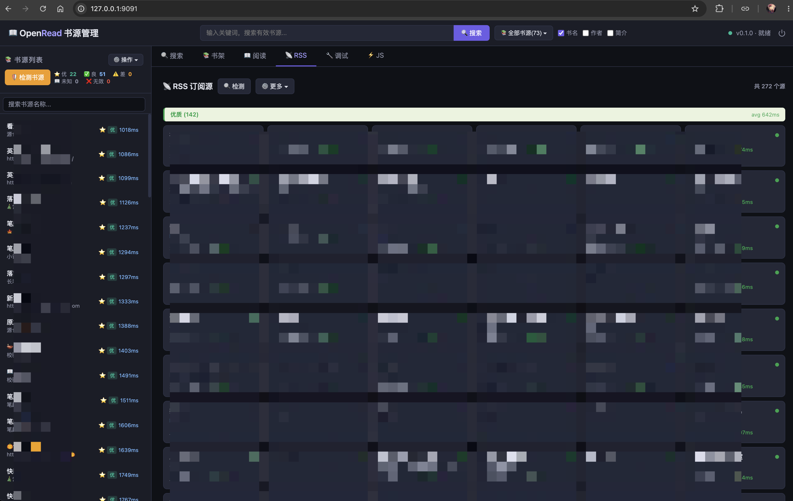

<div align="center">

# ⚡ Aria

**Modern C++ MVVM for industrial-grade cross-platform software** · C++23 · reactive · coroutine-first

One C++ core. Six platforms. Elegant architecture for complex applications, explicit engineering contracts for long-term evolution.

Windows / macOS / Linux / iOS / Android / Web

[](https://en.cppreference.com/w/cpp/23)
[](LICENSE)
[](https://github.com/dqsjqian/Aria/actions/workflows/ci.yml)
[](#)

[English](README.en.md) | [简体中文](README.md)

</div>

---

## 📚 From beginner to expert: AriaTutorial

Want to learn Aria systematically? The companion repository **[AriaTutorial](https://github.com/dqsjqian/AriaTutorial)** is a 20-chapter, bilingual (Chinese/English) progressive tutorial, **each chapter shipping a minimal demo you can compile and run**.

- Every code block in an article is **character-for-character identical** to the source under `demos/`, not a hand-copied illustration;
- Every output block is the demo's **real stdout** on Windows / MSVC, checked automatically by script;
- Every chapter opens with one conclusion figure (data flow, dependency graph, state machine, or timeline) whose numbers also come from the demo's real run;
- The path covers: reactive core → collections and forms → binding and adapters → async, diagnostics and testing → a complete application.

## 🌟 Flagship example: AriaTools

Start with [AriaTools](https://github.com/dqsjqian/AriaTools) to see Aria in a real application. It is Aria's single flagship cross-platform example, driving Qt, iOS, Android, and Web from one C++ ViewModel. This repository now stays focused on the framework, acceptance tests, and minimal documentation snippets.

## 🚀 Aria in 30 seconds

Aria splits a screen in two. The **ViewModel** is plain C++ and knows nothing about any
UI library; the **View** is native widgets. `BindingEngine` joins them, and it only ever
talks to the `IViewAdapter` interface — so porting means swapping the adapter, nothing else.

**Upper half — the ViewModel (plain C++, unit-testable, shared by every platform)**

```cpp
// Splitting a bill: total ÷ people = each person's share.
struct BillViewModel {
    aria::Property<double> bill{100.0};   // read-write state
    aria::Property<int>    people{2};

    // Computed is a read-only derived value. You never write its
    // dependency list: the first evaluation reads bill and people, and
    // those two are recorded as its dependencies automatically.
    aria::Computed<double> per_person{[this] {
        return bill.get() / people.get();
    }};
};
```

There is no UI in that code and no UI header included — it runs under a console test.

**Lower half — wiring up the View (a dozen lines per platform; the UI itself stays native)**

First, the thing most likely to be misread: **you do not write the UI in C++.** Buttons,
layout and animation are still authored the usual way — Qt Designer, Storyboard, Compose,
HTML. The code below only hands widgets that already exist over to the engine, and the
three steps never change: ① construct the platform adapter ② build a `BindingEngine` from
it ③ bind a widget to a Property.

<details open>
<summary><b>Qt6</b> (Windows / macOS / Linux · plain C++)</summary>

```cpp
auto adapter = std::make_shared<aria::adapters::qt6::QtAdapter>();
aria::binding::BindingEngine engine{adapter};

BillViewModel vm;
// label_view wraps the QLabel you dragged out in Qt Designer
aria::adapters::qt6::QtView label_view{real_label};
engine.bind_text_projected(vm.per_person, label_view,
    [](double v) { return std::format("¥{:.2f}", v); });
```
</details>

<details>
<summary><b>iOS / UIKit</b> (the wiring file is Objective-C++ <code>.mm</code>; the UI is still Storyboard / SwiftUI)</summary>

```objc++
#import "aria/adapters/uikit/UIKitAdapter.hpp"

auto adapter = std::make_shared<aria::adapters::uikit::UIKitAdapter>();
aria::binding::BindingEngine engine(adapter, ui_dispatcher,
    aria::binding::BindingEngine::DispatchPolicy::SmartMarshal);

// Wrap the UILabel* from your Storyboard so C++ can bind to it
auto label = std::make_shared<aria::adapters::uikit::UIKitView>(self.totalLabel);
engine.bind_text_projected(vm.per_person, *label,
    [](double v) { return std::format("¥{:.2f}", v); });
```

`UIKitView` retains the `UIView*` under ARC and, on destruction, tells `BindingEngine` to
drop its subscriptions while the native view is still valid — so no callback ever reaches a
released widget.
</details>

<details>
<summary><b>macOS / AppKit</b> (same shape: <code>.mm</code> + NSView)</summary>

```objc++
#import "aria/adapters/appkit/AppKitAdapter.hpp"

auto adapter = std::make_shared<aria::adapters::appkit::AppKitAdapter>();
aria::binding::BindingEngine engine(adapter, ui_dispatcher,
    aria::binding::BindingEngine::DispatchPolicy::SmartMarshal);

auto label = std::make_shared<aria::adapters::appkit::AppKitView>(self.totalField);
engine.bind_text_projected(vm.per_person, *label, /* ... */);
```
</details>

<details>
<summary><b>Android</b> (UI in Kotlin / Compose; C++ only does the wiring)</summary>

```cpp
// Called on the Android UI thread with real android.view.View objects
auto adapter = std::make_shared<aria::adapters::jni::JniAdapter>(env);
aria::binding::BindingEngine engine(adapter);

aria::adapters::jni::JniView total_view(env, total_text_view);
engine.bind_text_projected(vm.per_person, total_view,
    [](double v) { return std::format("¥{:.2f}", v); });   // → TextView
```

Kotlin-side listeners forward native events back in (`adapter->notify_text_changed(...)` /
`notify_click(...)`), so **listener ownership stays on Android** while the C++ side stays
strongly typed. Compose has no addressable view object; use the side-channel shape from the
adapter guide.
</details>

<details>
<summary><b>Web</b> (no C++ in the browser — the frontend is HTML/JS, C++ runs server-side)</summary>

```cpp
aria::adapters::http::HttpAdapterConfig config;
config.port = 9090;
auto http = std::make_shared<aria::adapters::http::HttpAdapter>(config);

// Here a "widget" is a string ID matching a DOM element in the browser
auto& total = http->register_view("total", "text");

aria::binding::BindingEngine engine{http};
engine.bind_text_projected(vm.per_person, total,
    [](double v) { return std::format("¥{:.2f}", v); });
http->start();  // Property changes go out over SSE; user input comes back over REST
```
</details>

**That is the point**: five wiring snippets that look nearly identical, and the
`BillViewModel` above is byte-for-byte unchanged across all of them. Porting costs you
those dozen lines, not your business logic.

**After wiring — mutate data, the UI follows**

Once bound, the rest is platform-independent. The code below behaves identically on all
five platforms, and **not one line of refresh code is written by hand**:

```cpp
BillViewModel vm;                       // per_person = 100/2 = ¥50.00
// ... bound to a label via any of the platforms above ...

vm.people = 4;                          // label → ¥25.00
vm.bill   = 200.0;                      // label → ¥50.00
```

Change either `bill` or `people` and `per_person` recomputes and pushes to the label —
because its dependencies were recorded automatically on the `Computed`'s first evaluation.
You never wrote anything resembling "when people changes, update the label".

One detail worth knowing when you change several values in a row:

```cpp
// One at a time → one push each, so the label flashes an intermediate value
vm.bill = 300.0;    // label → ¥150.00  ← intermediate
vm.people = 4;      // label → ¥75.00

// Wrapped in batch → a single push at the end, no intermediate state
aria::reactive::batch([&] {
    vm.bill   = 1200.0;
    vm.people = 8;
});                 // label → ¥150.00 (once)
```

And a convenient default: **if the final result equals the current value, nothing is
notified at all.** Following on from above, a batch setting `bill=600, people=4` (still
150) leaves the label untouched.

The whole architecture in one picture — upper half is the pure C++ ViewModel, the middle
is `BindingEngine` (which only knows the `IViewAdapter` interface), and the bottom row is
the five native adapters:


Continue with the [binding guide](docs/guide/binding.md), the [per-platform adapter guides](docs/guide/adapters/), the [cookbook](docs/cookbook/README.md), or the full four-platform [AriaTools](https://github.com/dqsjqian/AriaTools) application.

## 🎯 Design philosophy and engineering strength

Aria brings **reactive state, asynchronous coroutines, and cross-platform binding into one modern C++ architecture, independent of UI toolkits**. Implement complex business logic once and give each platform its native experience.

Elegance comes from clear responsibilities: a ViewModel is an ordinary C++ class, with no required framework base class, macros, or code generator.
UI layers connect through `IViewAdapter`. Qt6 / AppKit / UIKit / JNI / HTTP share one binding protocol, so changing UI toolkits leaves the ViewModel intact.

**Built to the engineering standards of world-class industrial software.** Lifecycle, threading, error handling, and collection events have traceable [engineering contracts](docs/index.md#reference), checked through automated tests, fuzz testing, and reproducible [performance benchmarks](docs/reference/performance.md). Architectural elegance carries through to state updates, asynchronous cancellation, and cross-platform delivery.

| Architectural strength | Engineering design |
|---|---|
| **Modern C++ foundation** | C++23 baseline (GCC 14+ / Clang 19+ / AppleClang 21+ / MSVC v143) with full coroutines and concepts. Integrating projects must use C++23 or later. |
| **Native UI freedom** | Your UI toolkit owns widgets, layout, and animation. Aria unifies one-way and two-way state binding, sharing the business core while preserving native experiences. |
| **Layered compatibility** | `aria-abi` / `aria-runtime` / `aria-binding` maintain ABI stability within a major version, with matching compiler, standard library, and build options. Rebuild templates such as `Property<T>` and their containing types after updates. |
| **Open adapter protocol** | Qt6 / AppKit / UIKit / JNI / HTTP ship out of the box. Integrate other UI toolkits by implementing `IViewAdapter` (see the [adapter guides](docs/guide/adapters/)). |
| **Applications and learning resources** | AriaTools, AriaAgent, and AriaRead demonstrate cross-platform workbenches, agent GUIs, and reading engines. [Guides](docs/index.md), the [Cookbook](docs/cookbook/README.md), and engineering contracts cover the path from first integration to custom extensions. |

**Designed for shared C++ business logic, native multi-platform UIs, and long-term maintenance.** Aria owns business state and binding; the chosen UI toolkit owns rendering and UI reuse. An explicit adapter protocol connects the two.

## ✨ Core features

- 📦 **Template-based reactive core** — `Property<T>` / `Computed<T>` / `Effect` / `Command<>` / `ObservableList<T>` / `Validator<T>` share one reactive dependency-graph engine. `Computed` auto-tracks deps; `reactive::batch` / `reactive::untracked` for fine control.
- 🔌 **Shared foundation and ABI layer** — `aria::core` automatically links `aria::abi` for shared graph, diagnostics and signal storage. Binary compatibility requires matching compiler, standard library, build options and major version. Rebuild template code and its containing types after updates.
- ⚡ **C++ coroutines** — `Task<T>`, executors, `co_await schedule_on(pool)`. Async code reads like sync code.
- 🖥 **Adapter abstraction** (`IViewAdapter`) — Qt6 / AppKit / UIKit / JNI / HTTP. Any UI toolkit, same business logic.

## 🏗 Architecture (10 modules)

```
┌────────────────────────────────────────────────────────────────────────┐
│                         Application                                    │
└────────────────────────────────┬───────────────────────────────────────┘
              ┌──────────────────┼──────────────────┐
              ▼                  ▼                  ▼
   ┌──────────────┐    ┌──────────────┐    ┌──────────────┐
   │ Qt6 adapter  │    │ JNI adapter  │    │ HTTP adapter │     (optional
   │ (Win/Mac/Lin)│    │  (Android)   │    │ REST/SSE Web │      modules;
   │ AppKit/UIKit │    │              │    │ Web browser   │      opt-in)
   └──────┬───────┘    └──────┬───────┘    └──────┬───────┘
          └───────────────────┴───────────────────┘
                              ▼
              ┌─────────────────────────────────┐
              │    aria-binding  (SHARED)       │
              │  BindingEngine + IViewAdapter   │
              └────────────────┬────────────────┘
                               │
        ┌──────────────────────┴───────────────────────┐
        ▼                                              ▼
┌───────────────────┐                       ┌────────────────────┐
│ aria-runtime      │                       │  aria-async        │
│ (SHARED .dylib)   │                       │   (header-only)    │
│ EventBus          │                       │ Task<T>            │
│ Container         │                       │ Scheduler          │
│ Dispatcher        │                       │ Executor           │
│ Logger            │                       │ schedule_on        │
└───────┬───────────┘                       └─────────┬──────────┘
        └──────────────────┬─────────────────────────—┘
                           ▼
              ┌─────────────────────────────┐
              │ aria-core  (header-only)    │
              │ Property / Computed / Cmd   │
              │ ObservableList / Validator  │
              │ Subscription                │
              └──────────────┬──────────────┘
                             ▼
              ┌─────────────────────────────┐
              │  aria-abi  (SHARED)      │
              │ Type-erased Signal/Slot     │
              │ ABI-stable, no templates    │
              └─────────────────────────────┘
```

| Module | Type | Depends on | Notes |
|--------|------|-----------|-------|
| `aria-abi` | `SHARED` by default | Threads | Compiled foundation: signals, shared reactive graph, diagnostics storage, scheduler base, and version metadata. Static builds are supported. |
| `aria-core` | header-only | abi | All the templates: `Property`, `Computed`, `Command`, `ObservableList`, `Validator`. Source-compatible only (not ABI-stable). |
| `aria-async` | header-only | core | Coroutine `Task<T>`, executors. Source-compatible only. |
| `aria-runtime` | `SHARED` | core, abi | EventBus / Container / Dispatcher / Logger — singletons live in **one** dylib. **ABI-stable** (non-template exports). |
| `aria-binding` | `SHARED` | core, runtime | `BindingEngine`, `IViewAdapter`. **ABI-stable** (non-template exports). |
| Adapters | `SHARED`/`STATIC` | binding | Qt6 / AppKit / UIKit / JNI / HTTP (each opt-in). WASM is conditional roadmap work. |

## 📋 Requirements

- **CMake** >= 3.20
- **Compiler** with full C++23 support:
  - GCC >= 13 (the MSYS2 UCRT64 toolchain on Windows)
  - Clang >= 18 (AppleClang 21+ on macOS)
  - **MSVC v143 / Visual Studio 2022** (Windows, see below)
- *(optional)* **Qt6** >= 6.4 (for the Qt6 adapter)

> **Windows is supported on two toolchains: MSYS2 UCRT64 (GCC) and
> MSVC / Visual Studio 2022.** Pick whichever fits your team's existing
> stack — both build the full framework + tests + adapters from a single
> tree, no source forks. See ["Windows toolchains"](#windows-toolchains) below.

## 🚀 Quick start

```bash
git clone https://github.com/dqsjqian/Aria.git
cd Aria
cmake -B build/flavors/release -DCMAKE_BUILD_TYPE=Release
cmake --build build/flavors/release -j
ctest --test-dir build/flavors/release --output-on-failure
```

> `build/` is a *container* for build trees — never configure straight into
> it. The unified build layout is documented at the top of
> [`scripts/build.sh`](scripts/build.sh); the
> per-flavor script `scripts/build.sh [release|debug|asan|tsan]` picks the
> right directory for you.

> Normal builds use the bundled doctest header. CMake fetches the fallback
> test dependency only if that vendored header is absent.

### One-liner build scripts

```bash
# macOS / Linux
scripts/build.sh             # release
scripts/build.sh tests       # release + ctest
scripts/build.sh asan        # debug + AddressSanitizer + UBSan
scripts/build.sh tsan        # debug + ThreadSanitizer
scripts/build.sh clean

# Windows — MSYS2 UCRT64 (GCC + Ninja)
scripts\build.ps1            # release
scripts\build.ps1 tests
scripts\build.ps1 asan
scripts\build.ps1 tsan       # debug + ThreadSanitizer (not available on MSVC, see below)

# Windows — MSVC / Visual Studio 2022
scripts\build-msvc.ps1       # release  (build/flavors/msvc/ tree)
scripts\build-msvc.ps1 tests
scripts\build-msvc.ps1 debug
scripts\build-msvc.ps1 asan  # /fsanitize=address (no UBSan on MSVC)
```

### Windows toolchains

Aria ships with **two parallel build scripts** for Windows. They live
side-by-side in `scripts/`, write to separate build directories, and
neither one needs to know about the other.

| Toolchain | Script | Build dir | Notes |
|---|---|---|---|
| **MSYS2 UCRT64** (GCC 14+ / Clang 19+) | `scripts\build.ps1` | `build/` | Lightweight (~300 MB). Pre-installed on most CI images. Auto-detected from `C:\msys64\ucrt64\bin` and a few other common paths. |
| **MSVC v143** (VS 2022) | `scripts\build-msvc.ps1` | `build/flavors/msvc/` | Auto-detects the VS install via `vswhere`, scrubs MSYS2 env vars (`INCLUDE` / `LIB` / `CPATH` / ...) before running CMake, and uses the `Visual Studio 17 2022` generator. |

You can switch back and forth without `clean` — the two trees are
isolated. CI runs both nightly to make sure neither regresses.

#### MSVC one-time setup

```powershell
# 1. Install Visual Studio 2022 Build Tools (or the full IDE) with
#    workload "Desktop development with C++" + "C++ CMake tools".
# 2. (Optional) install Qt 6 with the msvc2022_64 kit if you need the
#    Qt6 adapter.
# 3. From any PowerShell window:
scripts\build-msvc.ps1 tests
```

#### MSYS2 one-time setup

```powershell
# 1. Install MSYS2 from https://www.msys2.org
# 2. Open the "MSYS2 UCRT64" shell:
pacman -Syu
pacman -S --needed mingw-w64-ucrt-x86_64-toolchain `
                   mingw-w64-ucrt-x86_64-cmake `
                   mingw-w64-ucrt-x86_64-ninja git
# 3. (Optional) Add C:\msys64\ucrt64\bin to your PATH.
# 4. From any shell:
scripts\build.ps1 tests
```

Rationale for shipping both: Aria uses C++ coroutines extensively that
libstdc++, libc++, **and** the MSVC STL all handle cleanly. Pinning a
single Windows toolchain artificially excluded a large chunk of users
in the .NET / Visual Studio ecosystem — we now validate against MSVC
v143 on the same release gate as macOS, Ubuntu, and MSYS2.

### Use it from your own project

**Option A — `find_package` after install** (recommended for production):

```bash
# In the aria tree:
cmake -S . -B build/flavors/release -DCMAKE_BUILD_TYPE=Release -DCMAKE_INSTALL_PREFIX=/usr/local
cmake --build build/flavors/release -j && sudo cmake --install build/flavors/release
```

```cmake
# In your project's CMakeLists.txt:
find_package(aria 2.0 CONFIG REQUIRED)
add_executable(my_app main.cpp)
target_link_libraries(my_app PRIVATE aria::aria)
# or pick individual modules: aria::core / ::async / ::runtime / ::binding
```

Installed Linux shared libraries resolve other Aria libraries from their own
directory. Keep these libraries together; after moving the SDK, configure
consumers against its new installation path.

**Option B — vendored (no install)**:

```cmake
add_subdirectory(third_party/aria EXCLUDE_FROM_ALL)
target_link_libraries(my_app PRIVATE aria::core aria::async)
```

### Flagship example

[AriaTools](https://github.com/dqsjqian/AriaTools) is the single flagship cross-platform example, driving Qt, iOS, Android, and Web from one C++ ViewModel, with all four shells gated in CI. It is also the reference for both Android integration shapes: the Compose side-channel and the typed JniAdapter. The Aria repository no longer carries application examples. Framework behavior is pinned by `tests/acceptance/` and module tests, while these docs keep only focused, minimal snippets.

### Build options

| Option | Default | Description |
|--------|--------|-------------|
| `ARIA_BUILD_TESTS` | ON | Build unit tests + ctest registration. |
| `ARIA_BUILD_BENCHMARK` | ON | Build the micro-benchmark suite. |
| `ARIA_BUILD_SHARED` | ON | Runtime/binding as `.dylib`/`.so`/`.dll` instead of `.a`. |
| `ARIA_BUILD_QT6` | OFF | Build the Qt6 adapter (requires `Qt6Widgets`). |
| `ARIA_BUILD_APPKIT` | OFF | **(production-grade)** Build the macOS AppKit adapter as a first-class `STATIC` CMake module using Objective-C++; ships `aria::adapters::appkit` and passes the shared `adapter_conformance` battery. Requires `APPLE`. |
| `ARIA_BUILD_UIKIT` | OFF | **(production-grade)** Build the iOS UIKit adapter as a first-class `STATIC` CMake module using Objective-C++; ships `aria::adapters::uikit` and passes the shared conformance battery. Requires `APPLE`. |
| `ARIA_BUILD_JNI` | OFF | Build Android JNI adapter as a first-class CMake module — built as `STATIC`, ships `aria::adapters::jni`, implementing the same `IViewAdapter` contract as Qt/AppKit/UIKit via reflective JNI dispatch (text / bool / int / double / visibility / click). Requires an Android NDK toolchain (**NDK r26+** — the C++20-concepts core does not build under NDK r25's libc++). |
| `ARIA_ENABLE_ASAN` | OFF | AddressSanitizer. |
| `ARIA_ENABLE_UBSAN` | OFF | UndefinedBehaviorSanitizer. |
| `ARIA_ENABLE_TSAN` | OFF | ThreadSanitizer. |

## 👋 Hello, world

The section above needs a UI adapter. To see the reactive core on its own, you need no UI
at all:

```cpp
#include "aria/aria.hpp"
using namespace aria;

Property<int> count{0};

// No explicit dependency list — the first evaluation reads count, so
// count is recorded as a dependency automatically.
Computed<std::string> label([&]{
    return "count = " + std::to_string(count.get());
});

Command<> increment([&]{ count = count.get() + 1; });

// bind opens a subscription: it fires once immediately with the current
// value, then again on every change. The returned Subscription is the
// handle that OWNS that subscription's lifetime — so you must keep it.
// Write `label.bind(...);` and discard the result and the temporary dies
// on that very line, taking the subscription with it: nothing would ever
// print. (bind is [[nodiscard]], so the compiler warns you.)
auto sub = label.bind([](const std::string& s) { std::cout << s << '\n'; });
// ↑ this line has already printed "count = 0" (the initial sync)

increment();   // → "count = 1"
increment();   // → "count = 2"

// sub unsubscribes on destruction — no manual deregistration. You can
// also disconnect early:
sub.release();
increment();   // prints nothing
```

So `sub` exists to **express the subscription's lifetime as a scope**: while the variable
lives the subscription lives, and when it goes the subscription is torn down. In a real UI
this `Subscription` is usually a member of the View, so destroying the View detaches the
binding and no callback ever reaches a destroyed widget.

## ⚡ Async (C++ coroutines)

```cpp
#include "aria/async/task.hpp"
#include "aria/async/executor.hpp"
using namespace aria::async;

Task<std::string> fetch_user(int id) {
    co_await schedule_on(network_pool);     // jump to worker thread
    auto raw = http::get("/users/" + std::to_string(id));
    co_await schedule_on(main_dispatcher);   // jump back to UI thread
    co_return parse(raw);
}
```

## 🌍 Cross-platform mapping

| Platform   | UI host        | Adapter                            |
|------------|----------------|------------------------------------|
| Windows    | Qt6            | `aria-qt6` ✅ ready (MSYS2 UCRT64 + MSVC 2022) |
| macOS      | AppKit / Qt6   | `aria-qt6` ✅ ready; AppKit ✅ ready |
| Linux      | Qt6            | `aria-qt6` ✅ ready             |
| iOS        | UIKit          | `aria-uikit` ✅ ready |
| Android    | Compose / View | `aria-jni` ✅ ready (NDK r26+)   |
| **Web (server-driven)** | **HTML/JS in browser** | **`aria-http` ✅ ready (REST + SSE)** |
| Web (in-browser C++) | DOM via WASM     | Not implemented; conditional roadmap work             |

The HTTP adapter ships a small server (`HttpAdapter`) that exposes any
ViewModel over a JSON REST + Server-Sent-Events protocol, plus a
vanilla-JS browser SDK (`aria_client.js`). The server is built on the
the coroutine-native **Mira** networking library (HTTP/1.1 + SSE) and
**nlohmann::json** (encode/decode) — both committed under
`third_party/`, so the adapter adds no new external build dependency;
aria itself owns the wire protocol, view registry, subscription dispatch
and SSE fan-out. It is the right shape for
desktop apps that want a web UI on the side, headless services, and
local debug dashboards. The WASM adapter — which compiles C++ business
logic into the browser sandbox — solves a different, more constrained
problem and remains conditional on a concrete consumer. See
[RFC 0001](docs/rfc/0001-http-adapter.md) for the design.

The **current release** ships the platform-agnostic core, runtime, async, and
binding layers — fully unit-tested. Qt6, AppKit, UIKit, JNI, and HTTP are
first-class opt-in adapters in the CMake tree (subject to their platform
requirements). WASM and SwiftUI remain conditional roadmap work.

## 🖼 Real-world showcase

The big picture first — three real applications grew out of one framework:


Below is what Aria looks like in real applications — one C++ ViewModel, native shells per
platform. **[AriaTools](https://github.com/dqsjqian/AriaTools)** (17-module cross-platform
workbench on Qt / iOS / Android / Web), **[AriaAgent](https://github.com/dqsjqian/AriaAgent)**
(provider-agnostic LLM Agent GUI), and [AriaRead](https://github.com/dqsjqian/AriaRead)
(cross-platform book-source engine, HTTP/SSE web shell) all run Aria 1.x in production
shape. Every screenshot comes from a stable release: one build, one shared C++ business
core across platforms.

### AriaTools — cross-platform workbench (17 modules)

Aria's flagship example: one ViewModel, four platforms. The cart / theme switching /
Framework Lab / Echo modules in the side navigation are all driven by `ObservableList`,
`Computed`, and `reactive::batch`.

| Platform | Screenshot | Adapter |
|---|---|---|
| macOS (Qt6) |  | `aria-qt6` |
| iOS / UIKit |  | `aria-uikit` |
| Android (Compose side-channel) |  | `aria-jni` |
| Web (HTTP/REST/SSE) |  | `aria-http` |

### AriaAgent — LLM Agent GUI

A provider-agnostic Agent GUI built on Aria + Qt6: true token-level streaming SSE,
tool-call chain visualization, permission approval (fail-closed), Markdown rendering.

| View | Screenshot |
|---|---|
| Main chat |  |
| Settings (General / Model / Plugins / Agent Presets) |  |

### AriaRead — cross-platform book-source engine

A book-source manager powered by the Aria HTTP adapter: source list on the left, book
cards on the right — search, subscribe, and debug in one place. The same C++ core drives
two web shapes: a REST+SSE thin client and an SSR variant.

| View | Screenshot |
|---|---|
| Source manager (Web, REST + SSE) |  |
| Source manager (Web, SSR) |  |

> These screenshots show the macOS example applications. Other platforms reuse
> the ViewModel; native appearance depends on the platform, Qt style, and host
> application. Consult CI for framework build and test results on Windows/Linux.

## 🧪 Test status

```bash
ctest --test-dir build/flavors/release --no-tests=error --output-on-failure
```

Tests exercise reactive state, collection events, async cancellation, binding
lifetimes, ABI, and adapter contracts. Enabled suites depend on platform and
build options. See [CI results](https://github.com/dqsjqian/Aria/actions/workflows/ci.yml),
[lifecycle contracts](docs/reference/lifecycle.md), and the
[error model](docs/reference/error-model.md).

## 📊 Benchmarks

Measured on 2026-09-13: Apple M3 Pro / Apple Clang 21 / C++20 Release
(`-O3 -DNDEBUG`). Each entry is the median of five paired runs' mean operation
times, comparing original revision `eeb613f` with 2.0 snapshot `c33850d`.

| Operation | Original | Current |
|---|---:|---:|
| Property set, no observers | 20.5 ns | 13.2 ns |
| Property set, one observer | 98.9 ns | 35.0 ns |
| Computed chain ×5 | 570.8 ns | 229.0 ns |
| Ten sets in one batch | 250.6 ns | 102.5 ns |
| FilteredList tail append, 10k initial rows | 11.18 μs | 0.23 μs |
| SortedList random-key append, 10k initial rows | 8.38 μs | 17.28 μs |

Performance is mixed: owning event data and maintaining correct ordering after
batched changes also have costs. See the [performance reference](docs/reference/performance.md)
for all scenarios, complexity, remaining regressions, and reproduction details.

## 📋 Framework contracts

Every non-trivial behaviour Aria promises is pinned in a numbered
contract document. Each contract item carries an ID (e.g. `L-13`,
`E-22`, `LD-7`, `D-4`, `S-31`) so a failing assertion or PR review
comment can point straight at the canonical description.

| Document | Prefix | Scope |
|---|---|---|
| [`docs/reference/api-style.md`](docs/reference/api-style.md)            | `S-N`  | Naming, namespace, error and async-entry style |
| [`docs/reference/lifecycle.md`](docs/reference/lifecycle.md)            | `L-N`  | Threading, subscription, reactive flush, view-destroy, async cancel/dtor invariants |
| [`docs/reference/error-model.md`](docs/reference/error-model.md)        | `E-N`  | `aria::Error` / `ErrorKind` taxonomy and per-subsystem error contracts |
| [`docs/reference/list-diff-contract.md`](docs/reference/list-diff-contract.md) | `LD-N` | `Insert / Remove / Replace / Move / Reset / ItemChanged` semantics |
| [`docs/reference/diagnostics.md`](docs/reference/diagnostics.md)        | `D-N`  | `aria::TraceEvent` + `aria::TraceSink` protocol |
| [`docs/reference/performance.md`](docs/reference/performance.md)        | `PERF-N` | Complexity bounds and per-operation baselines for every public API |

The P0 hard-bedrock pass (see CHANGELOG → *Latest framework-grade
hardening*) closed every open contract above; the seven
framework-level fuzzers in `modules/core/fuzz/` stress-verify the
lifecycle invariants (default 50k iterations / fuzzer; nightly runs
set `ARIA_FUZZ_ITERS=1000000`).

## 🗺 Capabilities

| Capability | Type | Where |
|---|---|---|
| Reactive state | `Property<T>` / `Computed<T>` / `Effect` | `aria/reactive/reactive.hpp` |
| Commands | `Command<Args...>` (reactive `can_execute`) | `aria/command.hpp` |
| Collections | `ObservableList<T>` + derived `Filtered/Sorted/Mapped/Distinct/Grouped/Paged` | `aria/observable_list.hpp`, `aria/derived/*` |
| Selection | `Selection<T>` / `MultiSelection<T>` (SE-1..SE-5) | `aria/selection.hpp` |
| Validation | `Validator<T>` / `FormValidator` / `ValidationState` + async rules | `aria/validator.hpp`, `aria/binding/form.hpp`, `aria/async/async_validator.hpp` |
| Async | `Task<T>` / `AsyncCommand` / `with_timeout` / `when_any` / `when_all` / `CancellationToken` | `aria/async/*` |
| Data fetching | `AsyncResource<T>` (SWR + dedupe) / `Loadable<T>` (5-state) | `aria/async/async_resource.hpp`, `aria/loadable.hpp` |
| Navigation | `Navigator` (`push`/`pop`/`push_for_result<R>`, route patterns) | `aria/binding/navigation.hpp` |
| Binding | `BindingEngine` / `IViewAdapter` / `IView` / `Converter` / `bind_view_lifetime` | `aria/binding/*` |
| Diagnostics | `TraceEvent` / `TraceSink` / `GraphInspector` (atomic check when disabled) | `aria/diagnostics.hpp` |

**Learn it:** the [documentation index](docs/index.md) links the guides,
the [Cookbook](docs/cookbook/README.md) (task-oriented recipes), and the
contract references. The public [API reference](https://dqsjqian.github.io/Aria/)
is generated from main. See the [2.0 migration guide](docs/migration-2.0.md)
when upgrading from 1.2.x. Build the reference locally with
`cmake -B build/flavors/docs -DARIA_BUILD_DOCS=ON && cmake --build build/flavors/docs --target aria_docs`.

## 🗺 Roadmap

Aria is open source (MIT License), hosted on [GitHub](https://github.com/dqsjqian/Aria).
The [roadmap](docs/ROADMAP.md) defines development priorities, planned capabilities,
and explicitly deferred work. See the [changelog](CHANGELOG.md) for delivered capabilities and release history.

## 🤝 Contributing

Contributions are welcome! Please open an issue first to discuss design changes.

- Code style is enforced by `.clang-format` and `.clang-tidy`.
- All changes must pass `ctest --output-on-failure`.
- New features require tests in the matching `modules/*/tests/` suite.

## 🙏 Acknowledgments

- [doctest](https://github.com/doctest/doctest) — lightweight test framework
- [nlohmann_json](https://github.com/nlohmann/json) — JSON for Modern C++
- [Mira](https://github.com/dqsjqian/Mira) — coroutine-native C++23 networking (the HTTP adapter transport)
- [OpenSSL](https://www.openssl.org/) — TLS 1.2/1.3 (version in `third_party/openssl/VERSION.dat`)
- [CPM.cmake](https://github.com/cpm-cmake/CPM.cmake) — CMake dependency management

## 📄 License

[MIT](LICENSE) © 2026 aria contributors

---

<div align="center">

**📖 Other languages**

[简体中文](README.md)

</div>
