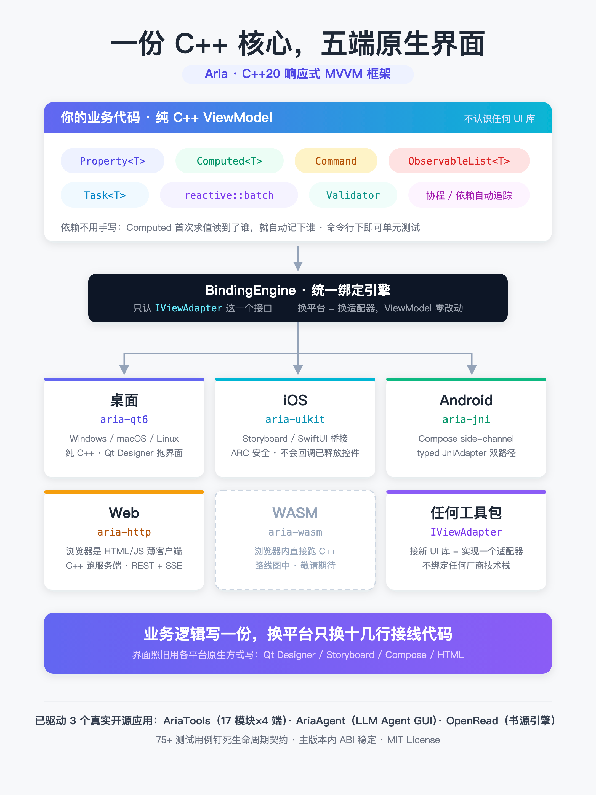
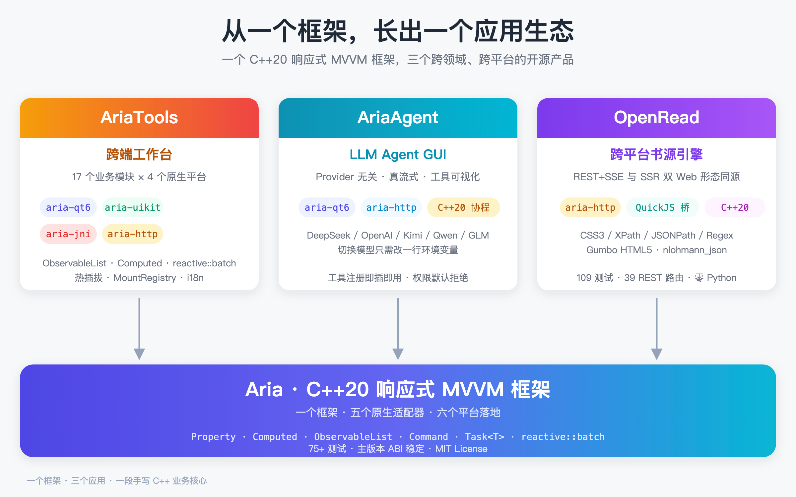
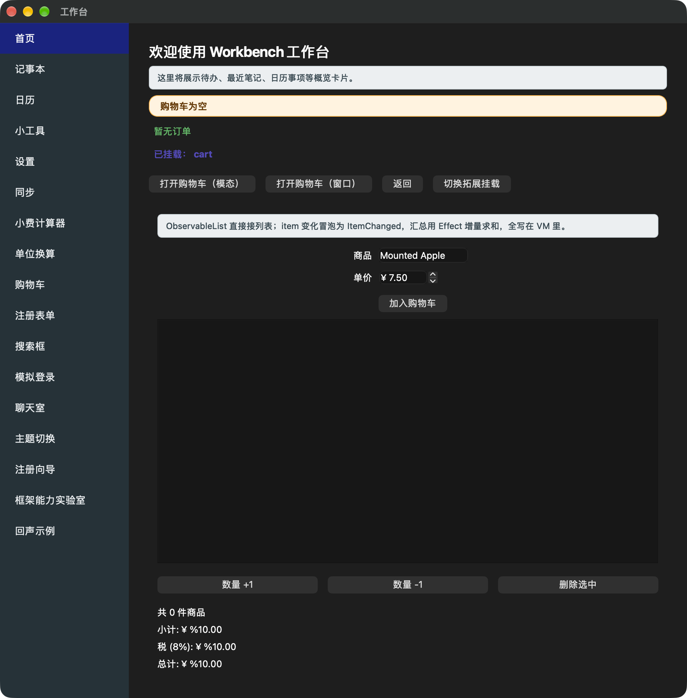
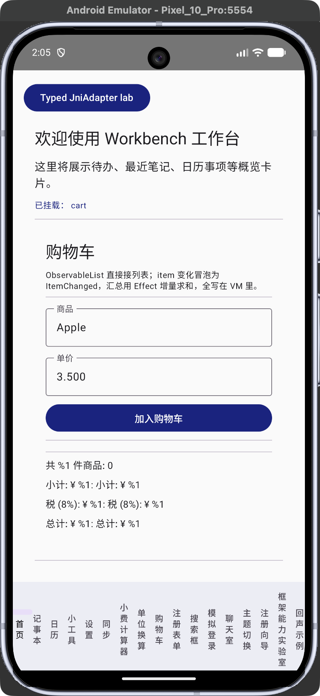
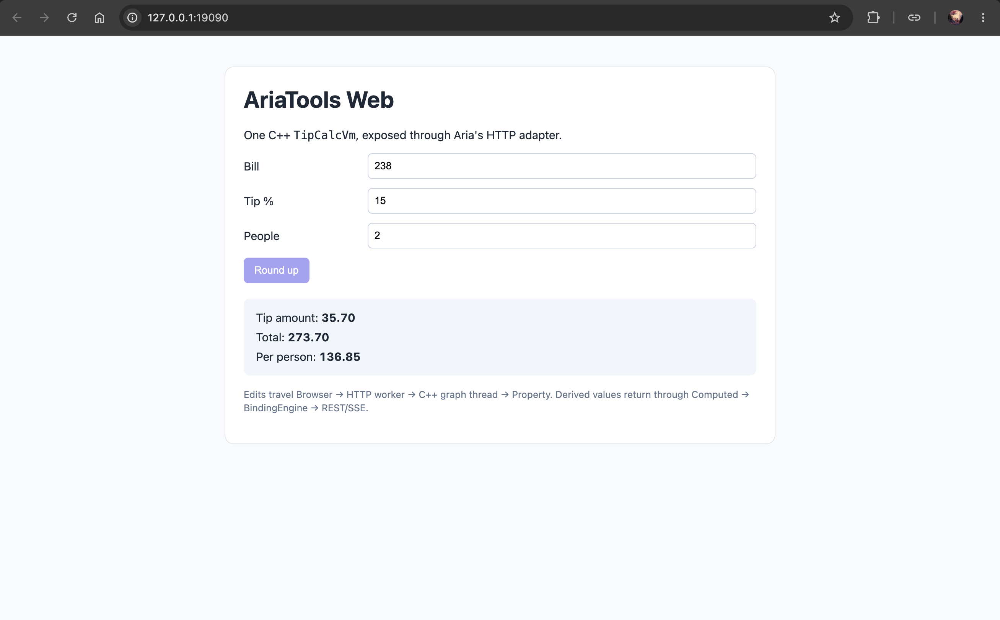
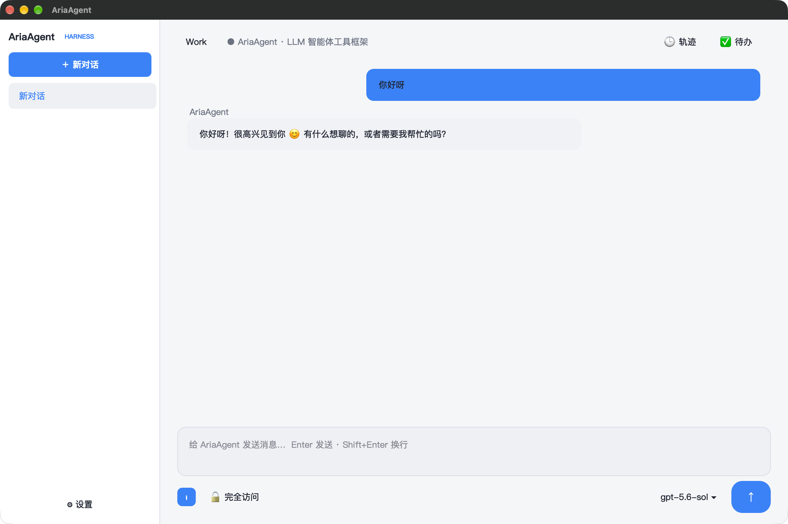
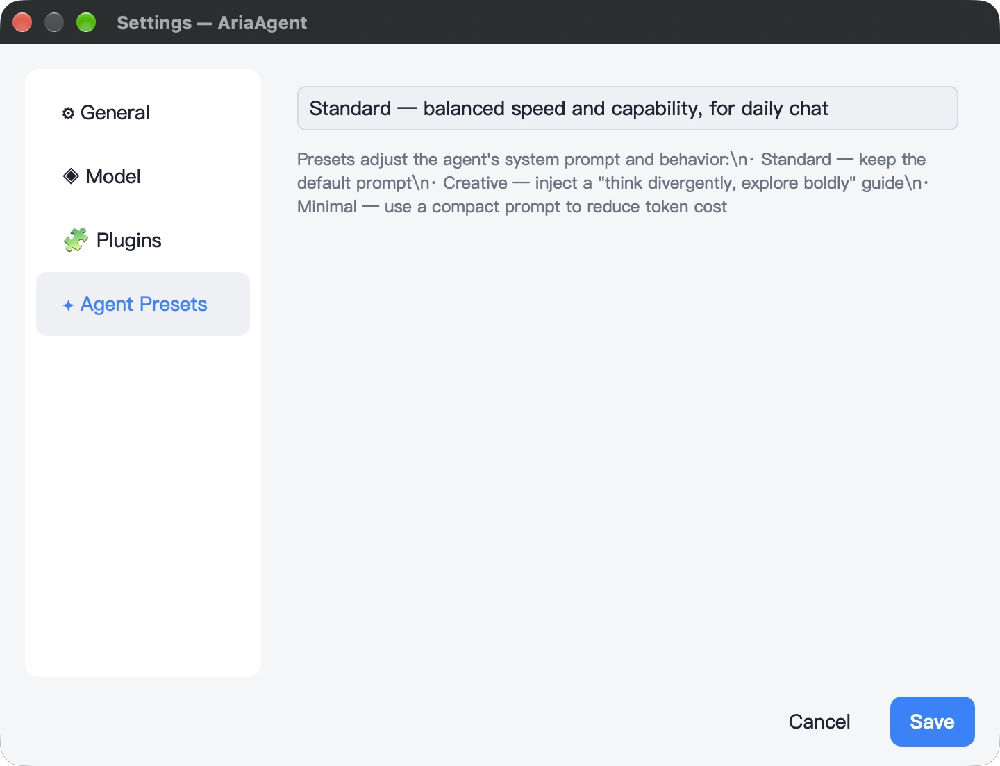

<div align="center">

# ⚡ Aria

**现代 C++20 MVVM 框架** · 跨平台 · 分层架构 · 协程优先

一套共享核心，覆盖 Windows / macOS / Linux / iOS / Android / Web

[](https://en.cppreference.com/w/cpp/20)
[](LICENSE)
[](https://github.com/dqsjqian/Aria/actions/workflows/ci.yml)
[](#)

[English](README.en.md) | [简体中文](README.md)

</div>

---

## 🌟 旗舰示例：AriaTools

想先看 Aria 如何落到真实应用？请从 [AriaTools](https://github.com/dqsjqian/AriaTools) 开始。它是 Aria 唯一的旗舰跨平台示例，同一份 C++ ViewModel 驱动 Qt、iOS、Android 与 Web 四端。本仓库只保留框架、验收测试和文档中的最小代码片段。

## 🚀 30 秒看懂 Aria

Aria 把一个界面切成两半：**ViewModel** 是纯 C++，不认识任何 UI 库；**View** 是各平台原生控件。
中间由 `BindingEngine` 连接，它只认 `IViewAdapter` 这个接口，所以换平台只换适配器。

**上半 —— ViewModel（纯 C++，可单元测试，所有平台共用这一份）**

```cpp
// AA 制账单：总额 ÷ 人数 = 每人多少
struct BillViewModel {
    aria::Property<double> bill{100.0};   // 可读写的状态
    aria::Property<int>    people{2};

    // Computed 是只读派生值。它的依赖不用手写：首次求值时读到了
    // bill 和 people，就自动记下这两个依赖。
    aria::Computed<double> per_person{[this] {
        return bill.get() / people.get();
    }};
};
```

这段代码里没有一行 UI，也没有 `#include` 任何界面库 —— 它在命令行下就能测。

**下半 —— View 侧接线（每个平台十几行，界面本身仍用各平台原生方式写）**

先说清最容易误会的一点：**界面不用 C++ 写。** 按钮、布局、动画照旧用 Qt Designer、
Storyboard、Compose、HTML 写。下面这十几行只是"把已经存在的控件交给 engine"的接线代码，
三步永远一样 —— ① 造平台适配器 ② 用它造 `BindingEngine` ③ 把控件和 Property 绑上。

<details open>
<summary><b>Qt6</b>（Windows / macOS / Linux · 纯 C++）</summary>

```cpp
auto adapter = std::make_shared<aria::adapters::qt6::QtAdapter>();
aria::binding::BindingEngine engine{adapter};

BillViewModel vm;
// label_view 包住你在 Qt Designer 里拖出来的那个 QLabel
aria::adapters::qt6::QtView label_view{real_label};
engine.bind_text_projected(vm.per_person, label_view,
    [](double v) { return std::format("¥{:.2f}", v); });
```
</details>

<details>
<summary><b>iOS / UIKit</b>（接线文件是 Objective-C++ <code>.mm</code>，界面仍是 Storyboard / SwiftUI）</summary>

```objc++
#import "aria/adapters/uikit/UIKitAdapter.hpp"

auto adapter = std::make_shared<aria::adapters::uikit::UIKitAdapter>();
aria::binding::BindingEngine engine(adapter, ui_dispatcher,
    aria::binding::BindingEngine::DispatchPolicy::SmartMarshal);

// 把 Storyboard 里的 UILabel* 包一层，C++ 侧就能绑它
auto label = std::make_shared<aria::adapters::uikit::UIKitView>(self.totalLabel);
engine.bind_text_projected(vm.per_person, *label,
    [](double v) { return std::format("¥{:.2f}", v); });
```

`UIKitView` 用 ARC 强引用持有 `UIView*`，析构时会在原生 view 还活着的时候通知
`BindingEngine` 清理订阅，所以不会回调到已释放的控件上。
</details>

<details>
<summary><b>macOS / AppKit</b>（同上，<code>.mm</code> + NSView）</summary>

```objc++
#import "aria/adapters/appkit/AppKitAdapter.hpp"

auto adapter = std::make_shared<aria::adapters::appkit::AppKitAdapter>();
aria::binding::BindingEngine engine(adapter, ui_dispatcher,
    aria::binding::BindingEngine::DispatchPolicy::SmartMarshal);

auto label = std::make_shared<aria::adapters::appkit::AppKitView>(self.totalField);
engine.bind_text_projected(vm.per_person, *label, /* ... */);
```
</details>

<details>
<summary><b>Android</b>（界面写 Kotlin / Compose，C++ 只接线）</summary>

```cpp
// 在 Android UI 线程上调用，传进来的是真实的 android.view.View 对象
auto adapter = std::make_shared<aria::adapters::jni::JniAdapter>(env);
aria::binding::BindingEngine engine(adapter);

aria::adapters::jni::JniView total_view(env, total_text_view);
engine.bind_text_projected(vm.per_person, total_view,
    [](double v) { return std::format("¥{:.2f}", v); });   // → TextView
```

Kotlin 侧的监听器把原生事件转发回来（`adapter->notify_text_changed(...)` /
`notify_click(...)`），**监听器归属仍在 Android 侧**，C++ 这边保持强类型。
Compose 没有可寻址的 view 对象，用文档里的 side-channel 形态。
</details>

<details>
<summary><b>Web</b>（浏览器里没有 C++ —— 前端是 HTML/JS，C++ 跑在服务端）</summary>

```cpp
aria::adapters::http::HttpAdapterConfig config;
config.port = 9090;
auto http = std::make_shared<aria::adapters::http::HttpAdapter>(config);

// "控件"在这里是字符串 ID，对应浏览器里的 DOM 元素
auto& total = http->register_view("total", "text");

aria::binding::BindingEngine engine{http};
engine.bind_text_projected(vm.per_person, total,
    [](double v) { return std::format("¥{:.2f}", v); });
http->start();  // Property 变化经 SSE 推给浏览器，用户操作经 REST 回来
```
</details>

**这才是重点**：五份接线代码长得几乎一样，而上面那个 `BillViewModel` **一个字都没改过**。
你换平台换的是这十几行，不是业务逻辑。

**接线之后 —— 只改数据，界面自己跟着变**

上面每个平台绑完，剩下的事就跟平台无关了。下面这段在五个平台上行为完全一致，
**没有一行手写的刷新代码**：

```cpp
BillViewModel vm;                       // per_person = 100/2 = ¥50.00
// ... 按上面任意一个平台绑定到 label ...

vm.people = 4;                          // label → ¥25.00
vm.bill   = 200.0;                      // label → ¥50.00
```

改 `bill` 或 `people` 任意一个，`per_person` 都会重算并推给 label —— 因为它的依赖是
`Computed` 首次求值时自动记下的，你没写过任何"people 变了要更新 label"这类代码。

连续改多个值时有一个细节值得知道：

```cpp
// 逐个改 → 每次都推一次，label 会闪过中间值
vm.bill = 300.0;    // label → ¥150.00  ← 中间态
vm.people = 4;      // label → ¥75.00

// 包进 batch → 只在结束时推一次，不出现中间态
aria::reactive::batch([&] {
    vm.bill   = 1200.0;
    vm.people = 8;
});                 // label → ¥150.00（一次）
```

还有一条省心的默认行为：**如果最终结果和当前值相同，一次通知都不会发。**
比如上面之后再 `batch` 里设 `bill=600, people=4`（仍是 150），label 不会被打扰。

整个架构一张图看全——上半是纯 C++ 的 ViewModel，中间是 `BindingEngine`（只认 `IViewAdapter` 接口），下半是五个原生适配器：



继续阅读：[绑定指南](docs/guide/binding.md) · [各平台适配器指南](docs/guide/adapters/) · [Cookbook](docs/cookbook/README.md) · [AriaTools](https://github.com/dqsjqian/AriaTools)（Qt / iOS / Android / Web 四端完整应用）。

## 🎯 定位与取舍

Aria 只做一件事：**把响应式引擎和绑定层从 UI 框架里拆出来，做成不绑定任何 UI 工具包的纯 C++20 库。**

ViewModel 是普通 C++ 类，不继承框架基类、不需要宏、不需要代码生成器。UI 层通过 `IViewAdapter`
接入，目前仓内已实现 Qt6 / AppKit / UIKit / JNI / HTTP 五个适配器；换 UI 工具包不需要动 ViewModel。

选它之前请先了解代价：

| 取舍 | 说明 |
|---|---|
| **要求 C++20** | 需要完整的协程与 concepts 支持（GCC 12+ / Clang 15+ / MSVC v143）。C++17 项目用不了。 |
| **不提供控件** | Aria 不画任何界面。控件、布局、动画仍由你选的 UI 工具包负责，Aria 只负责状态到界面的单向/双向数据流。 |
| **模板层仅源码兼容** | `aria-abi` / `aria-runtime` / `aria-binding` 在主版本号内 ABI 稳定；`Property<T>` 等模板跨版本需重编。 |
| **适配器要自己补** | 只有上述五个适配器开箱可用。接新工具包意味着实现一个 `IViewAdapter`（参考 [适配器指南](docs/guide/adapters/)）。 |
| **年轻项目** | 生态、教程、第三方组件都无法与成熟框架相比。目前只有 AriaTools 一个真实应用在用。 |

适合：已有 C++ 业务内核、要在多端复用同一份逻辑、且希望各端保留原生 UI 的项目。
不适合：想要「一份代码连界面一起跨端」的场景 —— 那是 Flutter、Qt Quick 这类完整 UI 框架的领域，
它们各有成熟的响应式绑定方案，Aria 不试图取代它们。

## ✨ 核心特性

- 📦 **仅头文件核心** —— `Property<T>` / `Computed<T>` / `Effect` / `Command<>` / `ObservableList<T>` / `Validator<T>` 共享同一个响应式依赖图引擎。`Computed` 自动跟踪依赖，`reactive::batch` / `reactive::untracked` 精确控制通知范围。
- 🔌 **类型擦除 ABI 层** —— `aria-abi` / `aria-runtime` / `aria-binding` 在主版本号内 ABI 稳定；模板层仅源码兼容。
- ⚡ **C++20 协程** —— `Task<T>`、执行器、`co_await schedule_on(pool)`，异步代码写起来像同步代码。
- 🖥 **适配器抽象** (`IViewAdapter`) —— Qt6 / AppKit / UIKit / JNI / HTTP / WASM，任何 UI 工具包都能用同一套业务逻辑驱动。

## 🏗 架构（10 个模块）

```
┌────────────────────────────────────────────────────────────────────────┐
│                         应用层 (Application)                            │
└────────────────────────────────┬───────────────────────────────────────┘
              ┌──────────────────┼──────────────────┐
              ▼                  ▼                  ▼
   ┌──────────────┐    ┌──────────────┐    ┌──────────────┐
   │ Qt6 适配器    │    │ JNI 适配器    │    │ HTTP 适配器   │     (可选模块；
   │ (Win/Mac/Lin)│    │  (Android)   │    │ REST/SSE Web │      按需启用)
   │ AppKit/UIKit │    │              │    │ WASM 计划中   │
   └──────┬───────┘    └──────┬───────┘    └──────┬───────┘
          └───────────────────┴───────────────────┘
                              ▼
              ┌─────────────────────────────────┐
              │    aria-binding  (SHARED)       │
              │  BindingEngine + IViewAdapter   │
              └────────────────┬────────────────┘
                               │
        ┌──────────────────────┴───────────────────────┐
        ▼                                              ▼
┌───────────────────┐                       ┌────────────────────┐
│ aria-runtime      │                       │  aria-async        │
│ (SHARED .dylib)   │                       │   (仅头文件)        │
│ EventBus          │                       │ Task<T>            │
│ Container         │                       │ Scheduler          │
│ Dispatcher        │                       │ Executor           │
│ Logger            │                       │ schedule_on        │
└───────┬───────────┘                       └─────────┬──────────┘
        └──────────────────┬─────────────────────────┘
                           ▼
              ┌─────────────────────────────┐
              │ aria-core  (仅头文件)        │
              │ Property / Computed / Cmd   │
              │ ObservableList / Validator  │
              │ Subscription                │
              └────────────┬──────────────┘
                             ▼
              ┌─────────────────────────────┐
              │  aria-abi  (STATIC .a)      │
              │ 类型擦除 Signal/Slot         │
              │ ABI 稳定，无模板              │
              └─────────────────────────────┘
```

| 模块 | 类型 | 依赖 | 说明 |
|------|------|------|------|
| `aria-abi` | `STATIC` | 无 | 类型擦除的信号/槽，无模板，**ABI 稳定**。 |
| `aria-core` | 仅头文件 | abi | 全部模板：`Property`、`Computed`、`Command`、`ObservableList`、`Validator`。仅源码兼容。 |
| `aria-async` | 仅头文件 | core | C++20 `Task<T>`、执行器。仅源码兼容。 |
| `aria-runtime` | `SHARED` | core, abi | EventBus / Container / Dispatcher / Logger —— 单例统一放在**一个**动态库中。**ABI 稳定**。 |
| `aria-binding` | `SHARED` | core, runtime | `BindingEngine`、`IViewAdapter`。**ABI 稳定**。 |
| 适配器 | `SHARED`/`STATIC` | binding | Qt6 / AppKit / UIKit / JNI / HTTP（按需启用）；WASM 计划中。 |

## 📋 环境要求

- **CMake** >= 3.20
- **完整支持 C++20 的编译器**：
  - GCC >= 12（Windows 下可走 MSYS2 UCRT64 工具链）
  - Clang >= 15（macOS/iOS 上 AppleClang 15+ 即可）
  - **MSVC v143 / Visual Studio 2022**（Windows，详见下文）
- *(可选)* **Qt6** >= 6.4（用于 Qt6 适配器）

> **Windows 同时支持 MSYS2 UCRT64（GCC）和 MSVC / Visual Studio 2022 两条工具链。** 团队栈里有哪个就用哪个 —— 同一棵源码树都能编出完整框架 + 测试 + 适配器，不需要分支或 fork。

## 🚀 快速开始

```bash
git clone https://github.com/dqsjqian/Aria.git
cd Aria
cmake -B build/flavors/release -DCMAKE_BUILD_TYPE=Release
cmake --build build/flavors/release -j
ctest --test-dir build/flavors/release --output-on-failure
```

> `build/` 是构建树的**容器**，不要直接配置进它。统一布局见 [`scripts/build.sh`](scripts/build.sh) 顶部。

### 🔧 一键构建脚本

```bash
# macOS / Linux
scripts/build.sh             # Release
scripts/build.sh tests       # Release + 跑测试
scripts/build.sh asan        # Debug + AddressSanitizer + UBSan
scripts/build.sh tsan        # Debug + ThreadSanitizer

# Windows —— MSYS2 UCRT64（GCC + Ninja）
scripts\build.ps1            # Release
scripts\build.ps1 tests
scripts\build.ps1 asan
scripts\build.ps1 tsan       # Debug + ThreadSanitizer（MSVC 不支持，见下）

# Windows —— MSVC / Visual Studio 2022
scripts\build-msvc.ps1       # Release（使用 build/flavors/msvc/ 目录）
scripts\build-msvc.ps1 tests
scripts\build-msvc.ps1 debug
```

### 🛠 Windows 工具链

| 工具链 | 脚本 | 构建目录 | 备注 |
|---|---|---|---|
| **MSYS2 UCRT64**（GCC 14+ / Clang 18+） | `scripts\build.ps1` | `build/` | 体积小（≈300 MB），大多数 CI 镜像已预装。 |
| **MSVC v143**（VS 2022） | `scripts\build-msvc.ps1` | `build/flavors/msvc/` | 通过 `vswhere` 自动定位 VS 安装；使用 `Visual Studio 17 2022` 生成器。 |

<details>
<summary>📖 MSVC 一次性配置</summary>

```powershell
# 1. 安装 Visual Studio 2022 Build Tools（或完整 IDE），勾选
#    "Desktop development with C++" + "C++ CMake tools"。
# 2. （可选）安装 Qt 6 的 msvc2022_64 组件。
# 3. 任意 PowerShell 窗口里：
scripts\build-msvc.ps1 tests
```
</details>

<details>
<summary>📖 MSYS2 一次性配置</summary>

```powershell
# 1. 从 https://www.msys2.org 安装 MSYS2
# 2. 打开 "MSYS2 UCRT64" 终端：
pacman -Syu
pacman -S --needed mingw-w64-ucrt-x86_64-toolchain \
                   mingw-w64-ucrt-x86_64-cmake \
                   mingw-w64-ucrt-x86_64-ninja git
# 3. （可选）把 C:\msys64\ucrt64\bin 加入 PATH
# 4. 从任意终端执行：
scripts\build.ps1 tests
```
</details>

### 📦 在自己的项目中使用

**方式 A —— 先安装，再用 `find_package`**（生产环境推荐）：

```bash
cmake -S . -B build/flavors/release -DCMAKE_BUILD_TYPE=Release -DCMAKE_INSTALL_PREFIX=/usr/local
cmake --build build/flavors/release -j && sudo cmake --install build/flavors/release
```

```cmake
find_package(aria 1.0 REQUIRED)
add_executable(my_app main.cpp)
target_link_libraries(my_app PRIVATE aria::aria)
# 也可以按需选择模块：aria::core / ::async / ::runtime / ::binding
```

**方式 B —— 直接嵌入（不安装）**：

```cmake
add_subdirectory(third_party/aria EXCLUDE_FROM_ALL)
target_link_libraries(my_app PRIVATE aria::core aria::async)
```

## 💻 旗舰示例

[AriaTools](https://github.com/dqsjqian/AriaTools) 是唯一的旗舰跨平台示例，同一份 C++ ViewModel 驱动 Qt、iOS、Android 与 Web 四端，四端均由 CI 把关。它也是 Android 两种集成形态（Compose side-channel 与 typed JniAdapter）的参考实现。Aria 仓库本身不再承载应用示例，框架行为由 `tests/acceptance/` 和各模块测试固定，文档只保留聚焦单一概念的最小片段。

## ⚙️ 构建选项

| 选项 | 默认值 | 说明 |
|------|--------|------|
| `ARIA_BUILD_TESTS` | ON | 构建单元测试并注册到 ctest。 |
| `ARIA_BUILD_BENCHMARK` | ON | 构建微基准测试。 |
| `ARIA_BUILD_SHARED` | ON | runtime/binding 编译为动态库。 |
| `ARIA_BUILD_QT6` | OFF | 构建 Qt6 适配器。 |
| `ARIA_BUILD_APPKIT` | OFF | macOS AppKit 适配器（需 `APPLE`）。 |
| `ARIA_BUILD_UIKIT` | OFF | iOS UIKit 适配器（需 `APPLE`）。 |
| `ARIA_BUILD_JNI` | OFF | Android JNI 适配器（需 NDK r26+）。 |
| `ARIA_BUILD_HTTP` | OFF | 构建 HTTP/REST/SSE 适配器。 |
| `ARIA_BUILD_WASM` | OFF | *(计划中)* WebAssembly 适配器。 |
| `ARIA_ENABLE_ASAN` | OFF | AddressSanitizer。 |
| `ARIA_ENABLE_UBSAN` | OFF | UndefinedBehaviorSanitizer。 |
| `ARIA_ENABLE_TSAN` | OFF | ThreadSanitizer。 |

## 👋 Hello, world

上一节需要 UI 适配器。如果只想在控制台里看清响应式本身，不需要任何 UI：

```cpp
#include "aria/aria.hpp"
using namespace aria;

Property<int> count{0};

// Computed 不需要显式依赖列表 —— 首次求值时读到了 count，
// 就自动记下这个依赖。
Computed<std::string> label([&]{
    return "count = " + std::to_string(count.get());
});

Command<> increment([&]{ count = count.get() + 1; });

// bind 建立订阅：先立刻用当前值调一次，之后 label 每次变化都再调一次。
// 返回的 Subscription 是这条订阅的"遥控器"，它决定订阅活多久 ——
// 所以必须接住。写成 `label.bind(...);` 丢掉返回值，临时对象立即析构，
// 订阅在这一行就断了，后面什么都不会打印（bind 标了 [[nodiscard]]，
// 编译器会警告你）。
auto sub = label.bind([](const std::string& s) { std::cout << s << '\n'; });
// ↑ 这一行就已经打印了 "count = 0"（initial sync）

increment();   // → "count = 1"
increment();   // → "count = 2"

// sub 析构时自动退订，不需要手写反注册；也可以提前主动断开：
sub.release();
increment();   // 不再打印任何东西
```

`sub` 的作用就是**用作用域表达订阅的生命周期**：变量活着订阅就活着，变量没了订阅自动断开。
在真实的 UI 里，这个 `Subscription` 通常存成 View 的成员，View 销毁时订阅随之解除，
不会回调到一个已经析构的控件上。

## ⚡ 异步编程（C++20 协程）

```cpp
#include "aria/async/task.hpp"
#include "aria/async/executor.hpp"
using namespace aria::async;

Task<std::string> fetch_user(int id) {
    co_await schedule_on(network_pool);     // 跳到工作线程
    auto raw = http::get("/users/" + std::to_string(id));
    co_await schedule_on(main_dispatcher);   // 切回 UI 线程
    co_return parse(raw);
}
```

## 🌍 跨平台映射

| 平台 | UI 宿主 | 适配器 | 状态 |
|------|---------|--------|------|
| Windows | Qt6 / WinUI | `aria-qt6` | ✅ MSYS2 UCRT64 + MSVC 2022 |
| macOS | AppKit / Qt6 | `aria-qt6` / `aria-appkit` | ✅ 可用 |
| Linux | Qt6 / GTK | `aria-qt6` | ✅ 可用 |
| iOS | UIKit / SwiftUI bridge | `aria-uikit` | ✅ 可用 |
| Android | Compose / View | `aria-jni` | ✅ 就绪（NDK r26+） |
| **Web（服务端驱动）** | **浏览器 HTML/JS** | **`aria-http`** | **✅ REST + SSE** |
| Web（浏览器内 C++） | DOM via WASM | `aria-wasm` | 🔜 计划中 |

## 🖼 跨端实战成果

先看全景——一个框架长出的三个真实应用：



下面这些是 Aria 框架在真实应用里跑出来的样子 —— 同一份 C++ ViewModel，跨多个平台的原生壳。**[AriaTools](https://github.com/dqsjqian/AriaTools)**（17 个模块的跨端工作台，Qt / iOS / Android / Web 四端）、**[AriaAgent](https://github.com/dqsjqian/AriaAgent)**（Provider 无关的 LLM Agent GUI）、[OpenRead](https://github.com/dqsjqian/OpenRead)（跨平台书源引擎，HTTP/SSE Web 壳）均已在生产形态上使用 Aria 1.x。所有截图均来自稳定版本，一次构建、跨端共用同一份 C++ 业务核心。

### AriaTools —— 跨端工作台（17 模块）

Aria 旗舰跨平台示例：一份 ViewModel 跑四端。左侧导航的购物车 / 主题切换 / Framework Lab / Echo 等模块，全部由 `ObservableList`、`Computed`、`reactive::batch` 驱动。

| 平台 | 截图 | 适配器 |
|---|---|---|
| macOS（Qt6） |  | `aria-qt6` |
| iOS / UIKit |  | `aria-uikit` |
| Android（Compose side-channel） |  | `aria-jni` |
| Web（HTTP/REST/SSE） |  | `aria-http` |

### AriaAgent —— LLM Agent GUI

Aria + Qt6 实现的 Provider 无关 Agent GUI：真流式 SSE、工具调用链可视化、权限审批、Markdown 渲染。

| 视图 | 截图 |
|---|---|
| 主界面（对话） |  |
| 设置（General / Model / Plugins / Agent Presets） |  |

### OpenRead —— 跨平台书源引擎

Aria HTTP 适配器驱动的书源管理 Web 端：左侧书源列表 + 右侧书本卡片网格，全文搜索、订阅、调试一站式。同一份 C++ 核心同时驱动 REST/SSE 薄客户端与 SSR 两种 Web 形态。

| 视图 | 截图 |
|---|---|
| 书源管理（Web / REST+SSE） |  |
| 书源管理（Web / SSR） |  |

> **关于 Windows / Linux 截图**：Mac 的壳是基于 **Aria（框架技术底座）+ Qt6 适配器（View 层）**做的，在 Windows / Linux 上跑出来的程序与 Mac 视觉上完全一致（同一份 Qt 控件 + 同一份 C++ ViewModel），所以不必重复截图。Windows 下还另有 MSVC + Qt6 与 MSYS2 UCRT64 两条工具链可以独立验证。

## 🧪 测试状态

```
$ ctest --test-dir build --output-on-failure
    Start 1: abi_tests           ✅ Passed
    Start 2: core_tests          ✅ Passed
    Start 3: fuzz_tests          ✅ Passed
    Start 4: async_tests         ✅ Passed
    Start 5: runtime_tests       ✅ Passed
    Start 6: binding_tests       ✅ Passed
    Start 7: qt6_tests           ✅ Passed   (ARIA_BUILD_QT6=ON)
    Start 8: appkit_conformance  ✅ Passed   (Apple 平台)
    Start 9: appkit_table_source ✅ Passed   (Apple 平台)

100% tests passed, 0 tests failed
```

75+ 个测试用例覆盖 `docs/reference/lifecycle.md`、`docs/reference/error-model.md` 中所有生命周期 / 重入 / 异常安全契约。

## 📊 性能基准（Apple M 系列, -O3 -DNDEBUG）

| 操作 | 纳秒/次 |
|-----------|-------|
| `Property<int>::get()` | 10.4 |
| `Property<int>::set()` 无观察者 | 28.5 |
| `Property<int>::set()` 1 个观察者 | 29.3 |
| `Property<int>::set()` 10 个观察者 | 45.9 |
| 订阅 + 自动取消订阅周期 | 54.9 |
| Computed 链 x5（set + 重新计算 + get） | 289.1 |
| `EventBus::publish`（1 个订阅者） | 13.4 |
| `Container::resolve<Singleton>` | 7.6 |
| 10 次 set 包在 `reactive::batch` 中 | 156.1 |
| 批量更新加速比（对比逐次更新） | **1.91×** |

## 📋 框架本体契约

所有非平庸行为都钉在带编号的契约文档里，每条契约有稳定 ID（如 `L-13` / `E-22` / `LD-7`）。

| 文档 | 前缀 | 范围 |
|---|---|---|
| [`api-style.md`](docs/reference/api-style.md) | `S-N` | 命名、命名空间、错误与异步风格约束 |
| [`lifecycle.md`](docs/reference/lifecycle.md) | `L-N` | 线程、订阅、flush、view 销毁、cancel/dtor 不变式 |
| [`error-model.md`](docs/reference/error-model.md) | `E-N` | `aria::Error` / `ErrorKind` taxonomy |
| [`list-diff-contract.md`](docs/reference/list-diff-contract.md) | `LD-N` | `Insert / Remove / Replace / Move / Reset` 语义 |
| [`diagnostics.md`](docs/reference/diagnostics.md) | `D-N` | `TraceEvent` + `TraceSink` 诊断协议 |
| [`performance.md`](docs/reference/performance.md) | `PERF-N` | 复杂度上界与实测基线 |

## 🗺 路线图

Aria 已开源（MIT License），源码托管在 [GitHub](https://github.com/dqsjqian/Aria)。待办与已延后清单的唯一信息源在 [`docs/ROADMAP.md`](docs/ROADMAP.md)；当前能力快照见 [`CHANGELOG.md`](CHANGELOG.md)。

## 🤝 贡献指南

欢迎贡献！涉及架构改动的请先开 Issue 讨论。

- 代码风格由 `.clang-format` 和 `.clang-tidy` 统一管控
- 所有变更必须通过 `ctest --output-on-failure`
- 新功能需要在对应 `modules/*/tests/` 套件中补充测试

## 🙏 致谢

- [doctest](https://github.com/doctest/doctest) —— 轻量级测试框架
- [nlohmann_json](https://github.com/nlohmann/json) —— JSON for Modern C++
- [cpp-httplib](https://github.com/yhirose/cpp-httplib) —— HTTP/HTTPS server
- [OpenSSL](https://www.openssl.org/) —— TLS 1.2/1.3（3.5 LTS）
- [CPM.cmake](https://github.com/cpm-cmake/CPM.cmake) —— CMake 依赖管理

## 📄 License

[MIT](LICENSE) © 2026 aria contributors

---

<div align="center">

**📖 其他语言**

[English](README.en.md)

</div>
